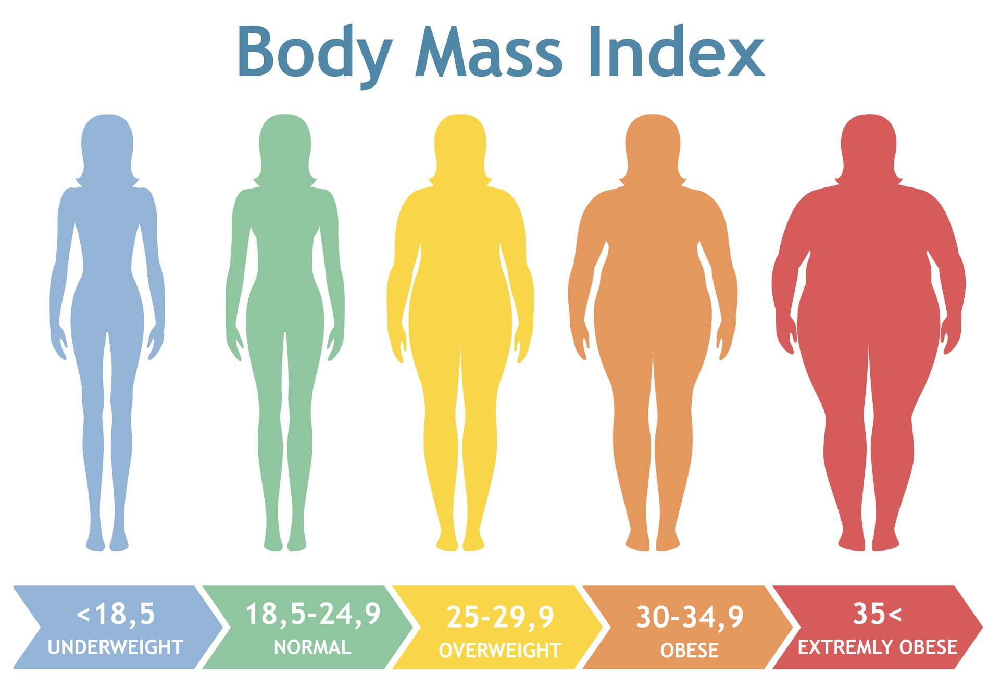

# Overfit_Level_I [](https://hub.docker.com/r/zachooos/obesityriskapp) 


Welcome to Overfit_Level_I! This repository showcases my work for the **Kaggle competition [S04E02](https://www.kaggle.com/competitions/playground-series-s4e2)**, focusing on Multi-Class Prediction of Obesity Risk. The goal of this competition is to use various factors to predict obesity risk in individuals, which is related to cardiovascular disease. 

My top performing model ranked in the **top 30% out of 2,840 competitors**. Applied an extensive Exploratory Data Analysis, along with F**eature Engineering, scikit-learn, SHAP, CatBoost, XGBoost, and LightGBM, and different Ensemble strategies**. You can read my analysis and developemnt in my [submission_notebook](notebook/submission_notebook.ipynb)

## ML App
One of the highlights of this project is the deployment of a Dockerized Flask application, which you can interact with, through HuggingFace Spaces. Check it here [OverfitLevelI](https://zaaachos-overfitleveli.hf.space/obesityRiskForm)

## Environment Setup

To get started with this project, follow these steps to set up your environment:
- Clone the Repository:

```bash
git clone https://github.com/zaaachos/Overfit-Level-I.git
```

- Install Dependencies
It is highly recommended it to use conda as your virtual enviroment:
```bash
conda create -n obesityEnv python=3.9
```
Navigate to the `webapp` project directory and install the necessary dependencies by running:
```bash
pip install -r requirements.txt
```

Run the Application Locally:
Once dependencies are installed, you can run the Flask application locally by executing:

```bash
python app.py
```

This will start the Flask server, and you can access the application at http://localhost:5000/obesityRiskForm in your web browser.


## Example video


## Next steps
- [x] Codify the work that is provided in my notebook
- [x] Make a web app using Flask and Postman
- [x] Dockerize and deploy it to docker Hub
- [x] Deploy to a cloud service (HuggingFace Spaces)
- [ ] Deploy to another cloud service with GitHub Actions
